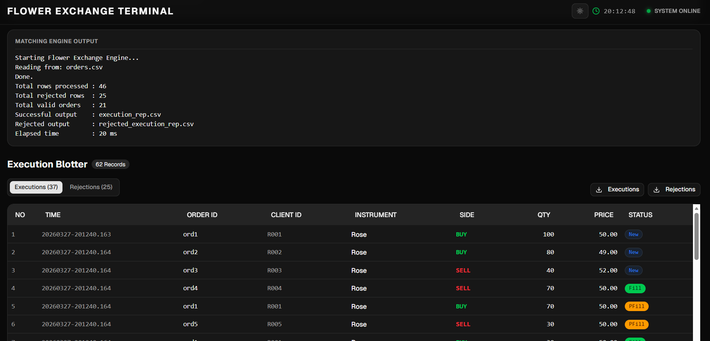

# Flower Exchange Engine

A high-performance C++ matching engine built as part of the LSEG C++ Bootcamp 2026. This project features a robust core for order matching, a Python backend server, and a modern web-based graphical user interface (GUI) for interacting with the engine.

## 🏗️ Architecture & Implementation

The repository is modularized into three main components:

### 1. C++ Core Engine (`src/`)
Our C++ implementation drives the high-performance matching logic. Key details include:
- **OrderBook & Priority Matching:** Implements an ultra-fast price-time priority matching engine. Buy and sell orders are maintained efficiently in memory.
- **CSV Data Processing:** Custom `CSVReader` and `CSVWriter` implementations for low-latency batch processing of bulk orders and execution reports.
- **Strict Validation:** Integrated validation rules (`Validator.cpp`) ensure that malformed or unauthorized orders are instantly rejected before hitting the matching algorithms.
- **Modern C++ Features:** Built utilizing modern C++17 features, standard template library (STL), and optimized data structures specifically tailored for throughput and minimal allocations.

### 2. Python Backend (`server/`)
A fast and lightweight REST API server built with Python, FastAPI and `uv` for modern dependency management. It operates as the secure bridge, executing the compiled C++ engine binaries and delivering instantaneous results to the web frontend.

### 3. React Web GUI (`gui/`)
A completely modern, responsive single-page React application built with Vite and Tailwind CSS. It allows users to quickly upload order CSV files through drag-and-drop mechanics, view structured execution reports, and analyze their matching and trade statistics vividly.



## 🗂️ Project Structure

```text
├── src/                # C++ codebase (OrderBook, MatchingEngine, Readers/Writers)
├── server/             # Python FastAPI backend
├── gui/                # React, Vite & Tailwind frontend
├── tests/              # Sample CSV orders for unit and integration testing
├── assets/             # Project screenshots and assets
├── QUICKSTART.md       # Detailed setup guidelines and architecture docs
└── README.md           # This documentation file
```

## 🚀 Quickstart

Follow these instructions to build the engine and run the application stack.

### 1. Compile the Core Engine (C++)

From the root directory, compile the C++ source code with optimal performance flags:

```bash
g++ -O3 -std=c++17 src/main.cpp src/CSVReader.cpp src/CSVWriter.cpp src/OrderBook.cpp src/MatchingEngine.cpp src/Validator.cpp src/OrderIDGenerator.cpp -o exchange
```

### 2. Server Setup (Python)

The backend server relies on `uv`, a blazingly fast Python package installer and resolver.

1. Navigate to the server directory:
   ```bash
   cd server
   ```
2. Install the required dependencies:
   ```bash
   uv sync
   ```
3. Run the backend server:
   ```bash
   uv run python main.py
   ```

### 3. GUI Setup (Node.js/React)

The frontend is a React application built with Vite.

1. Navigate to the GUI directory:
   ```bash
   cd gui
   ```
2. Install the required dependencies:
   ```bash
   npm install
   ```
3. Start the development server:
   ```bash
   npm run dev
   ```
   *(The application will instantly reflect changes and is typically available at `http://localhost:5173`)*

---
*Developed as the final project for the LSEG C++ Bootcamp 2026.*
